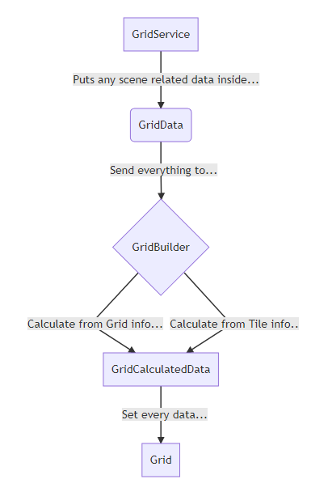

# Grid System

In order to easily be able to manipulate a tile based rpg game, this system was created.
It's a low level grid that can sustain pratically anything. In this documentation,
you'll see how to start it, use it and what are the possible behaviors or issues the system
can encounter.

## Initial Setup 

The Grid is just a data structure meant to access what's important about a grid, its tile positions. This system's job is NOT to save on which tile an entity is. The Grid uses integer or ID to track tiles. Therefor, People should have a tileID and with this ask the grid for the location it correspond. 

So to make a grid with custom editable and dynamic data for our game, we're using both scene oriented data and scriptable objects. Both can be used and the system will adapt. You can create a grid on your own and multiple grid can exist within a single game instance. See below on how to create a grid. For now, if you want to test a basic grid setup :

1. Put the GridService prefab in to the scene (make you able to link things from your scene into the system)

2. Make sure to link the prefab in the service bank

3. Add 2 location gameobjects into the scene and link them in the GridService

4. You should see a blue grid appear

5. Create your own script that use it ! (see bellow on how to use the grid)

N.B. for more information about services, head over 

## Customize your Grid

As you can see in the example, it's quite easy to initialise a simple grid system and customize it. There's actually 2 way you can edit the look of your grid. You can use Tile Info or Grid Info.

### Grid Info

Grid information are the ones describing the entire grid entity. You need to move 2 corners
location to define the area your grid will occupy. Those are created using the Location script if you want. 
You'll also need to link it in the GridService prefab instance your created in your scene. 
Then, you need to specify the number of tiles there is in a single row, it's the width of the grid. 
With this, we can easily generate a grid. If you decide to use this method, you'll probably need to use 
the method 1 of the setup section since there'll be 2 Location Game Object you can move around. 
You'll also be able to see a gizmo of what it'll look like when pressing play.

### Tile Info (In Developpement)

Tile Information define the width and height of a tile. You'll also need the center point of the grid, 
and the number of tiles you want. This might change since the system still needs to be done. It's a great
way to be able to manipulate a grid without changing the tiles you decided tp have. If the game need 4x4
tiles, whatever the grid, this needs to stay the same no matter what.

## Grid Creation

Since we can have multiple grid in a single game, the first thing you need to do is decide the location
of your new grid reference. Is it in a service ? a manager ? Once you know the location, here's what
you need to call in order to create your grid :

```
grid = new Grid(); // creating grid
data.SetGridValues(ref grid); // setup grid with our data
```

What's important here is the data. A GridData type variable (here name data) is used to setup the grid correctly.
For that to work you'll need to make sure you got the right data for the grid you want. Note that 
you'll use one of the two grid data type explained previously (Grid vs Tile, look up). Information can be provide
within a scene or just with constant. If data comes from the scene, you'll need to find a way
to give the reference to your script that instantiate the grid.

When you call those two lines, here's the road we're taking :



(Graph was made with the use of https://mermaidjs.github.io/mermaid-live-editor/)

## Using the Grid

Most of the time, when using the grid, you'll be interacting with a singleton that contains your Grid. The Grid itself contains basic
tile identification function. It doesn't interpret the grid to get more complex informations. This is the
job of the GridTools.cs. You can get neighboors, tiles in an aoe, shortest paths. It's goal is to do the work
in your place. Here's an example :

```
transform.position = GridService.Instance.grid.GetTilePosition(tileID);
```

As you can see, to identify the tiles, we're using a TileID. It was a generic class before, but for now all we need is an integer. It'll be easier for every system to communicate clearly if everyone's uses tile data the same way. So in a typical case, you'll only pass the
TileID (int) in your system, and with every TileID, it's really straight forward to get informations.
